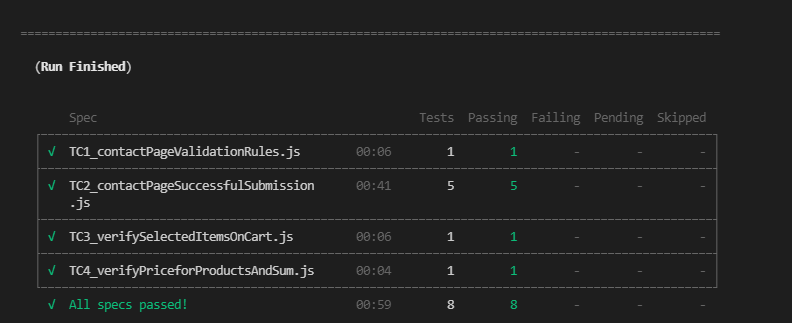
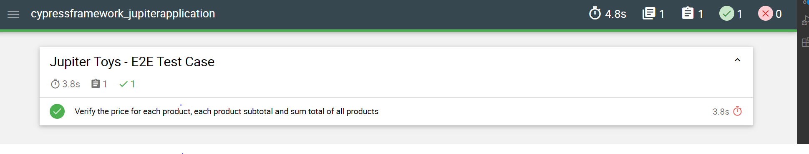
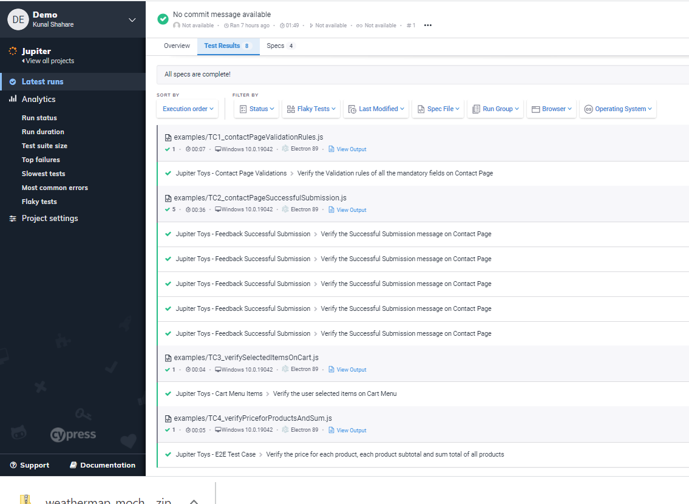

## Cypress E2E Test Automation Framework

## Overview
* This is simple E2E Test Automation Framework in JavaScript is using (Cypress, Mocha, Mochawesome).
* **Languages:** JavaScript/Node.JS
* **Build/Dependency Management:** npm
* **Testing Frameworks:** Cypress
* **Assertion Lib:** Cypress (inbuild Chai)
* **Reporting:** Mocha, Mochawesome, Cypress Dashboard

## Pre-requisites
* Install latest [Node.JS](https://nodejs.org/en/download/)
* Install latest [Visual Studio Code](https://code.visualstudio.com/download)
* Check access for Application Under Test [JupiterToys](https://jupiter.cloud.planittesting.com/#/).
* Create account to access [Cypress Dashboard](https://dashboard.cypress.io/). Make sure to add your key under package.json -> scripts -> recordDashBoardTest.

## Setup Project
* Clone the source code from git as per below command.<br />
```git clone https://github.com/KunalShahare/cypressframework_jupitercloudapplication.git```
* Import the Project into Visual Studio Code 
* Open Terminal and Navigate to Project Directory
* Run `npm install` to download all the dependencies / libraries.
* Run `node_modules\\.bin\\cypress open` to run the test using Cypress Runner
* Run `npm run test` to execute Test in CLI
* Run `npm run recordMochawesomeResults` to execute the Tests and generate Mochawesome report.
* Run `npm run recordDashBoardTest` to execute the Tests, Upload the results into Cypress Online Dashboard and generate Mochawesome report

## Results
* CLI Results


* mochawesome-report folder will be created under root folder automatically after first run.
* HTML Report Path `./mochawesome-report/mochawesome.html` <br />

* Dashboard Cypress Report with Screenshot & Video.




